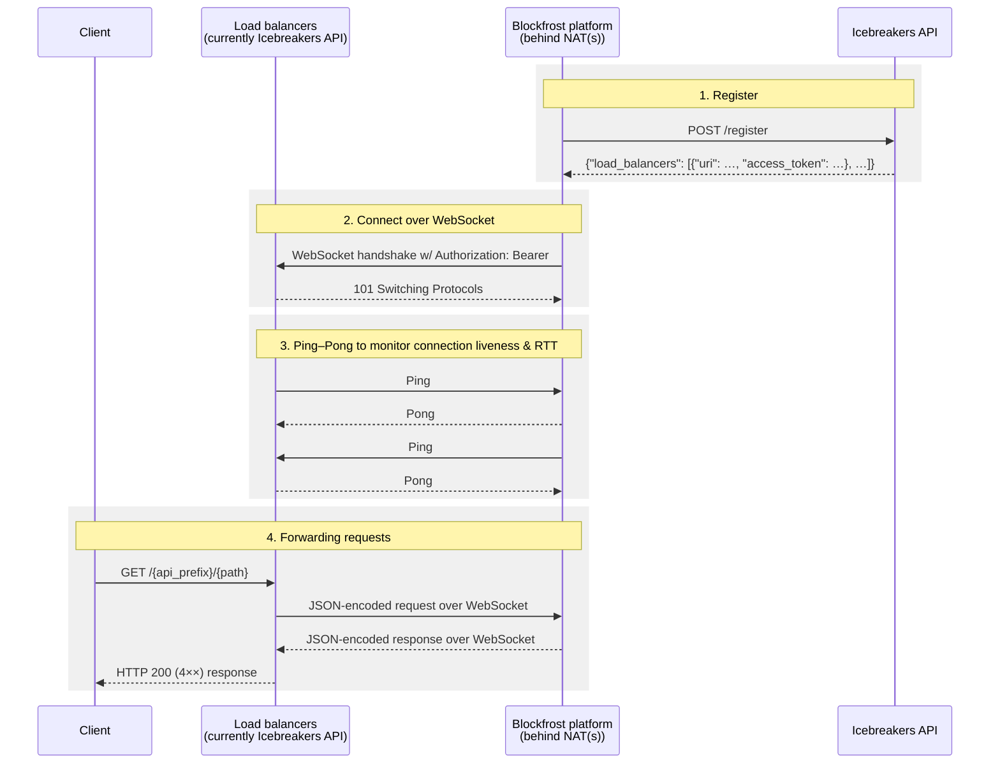

# Blockfrost Icebreakers

The Icebreakers program is an incentivized testing initiative featuring a network of Cardano node operators who participate by sharing their node resources.
These operators facilitate access to data stored on the Cardano blockchain, aiming to decentralize Blockfrost by leveraging the existing community infrastructure.

Each participating Cardano node operator installs the Blockfrost Platform software, which allows them to join the Blockfrost backend fleet and offer their resources.
In return, they earn revenue from the data services they provide.

Blockfrost customers seamlessly access this blockchain-stored data through the Icebreakers, often without being aware of the source.

## Diagram

The following diagram generally represents the first iteration of the Blockfrost Icebreakers network.
For more information, see the [Technical details](#technical-details) section below.


## Want to become an Icebreaker?

We still have some places left.
Come talk to us on [Discord](https://discord.com/invite/inputoutput) in the `#ask-blockfrost` channel.

## Technical details

The following sequence diagram provides a high-level overview of the communication:



### 1. Register

In [non-solitary mode](/options), when registering with the `blockfrost-icebreakers-api`, the `blockfrost-platform` gets an additional field in the successful response, with a list of load balancers to connect to:

```json
{
  "route": "b0be51e5-e5fe-4e42-98a9-2246173bea19",
  "load_balancers": [
    {
      "uri": "wss://icebreakers-api.blockfrost.io/ws",
      "access_token": "QNo3SYA0iPY+LfEhb2Gi5NaUOXqLw4b7ZQyg9DL4hFs="
    }
  ]
}
```

### 2. Connect over WebSocket

`blockfrost-platform` connects to the WebSocket endpoint, and sets `Authorization: Bearer <access_token>`.

Currently, this new WebSocket endpoint is served by the same IceBreakers API during initial testing. In the future, there will be multiple load balancers for high-availability.

### 3. Ping–Pong to monitor connection liveness, and the round-trip time

1. Both sides exchange `Ping` and `Pong` messages continuously, which allows us to detect the other side going offline quite quickly, even with silently dropped packets. And also to measure the pure network round-trip time, without the overhead of any advanced calculations.

2. The load balancer code exposes a `GET /stats` endpoint, where you can see all currently connected IceBreakers:

   ```
   ❯ curl -fsSL http://icebreakers-api.blockfrost.io/stats | jq .
   ```

   ```json
   {
     "IcebreakerX": {
       "api_prefix": "b0be51e5-e5fe-4e42-98a9-2246173bea19",
       "network_rtt_seconds": 0.000387182,
       "connected_since": "2025-03-28T19:09:46.399124184Z",
       "requests_sent": 0,
       "responses_received": 0,
       "requests_in_progress": 0
     }
   }
   ```

### 4. Forwarding requests

1. The most important load balancer endpoints are `GET /{api_prefix}/{path}`, and `POST /{api_prefix}/{path}`:
   - Using the example above, once you issue: `curl -fsSL https://icebreakers-api.blockfrost.io/b0be51e5-e5fe-4e42-98a9-2246173bea19/`, this request will be translated into a JSON message, and sent over the WebSocket connection with IcebreakerX (identified by its `api_prefix`):

     ```json
     {
       "id": "04810b96-87cd-4af0-8c1b-7b5e00806769",
       "method": "GET",
       "path": "/",
       "header": [
         {
           "name": "host",
           "value": "0.0.0.0:3001"
         },
         {
           "name": "user-agent",
           "value": "curl/8.11.1"
         },
         {
           "name": "accept",
           "value": "*/*"
         }
       ],
       "body_base64": ""
     }
     ```

   - Then this particular `blockfrost-platform` will resolve the request against its local HTTP server – all cheap, and in memory, without opening any new TCP connections to itself.
   - The response is encoded back into a JSON response message, and sent over the WebSocket to the load balancer:

     ```json
     {
       "id": "04810b96-87cd-4af0-8c1b-7b5e00806769",
       "code": 200,
       "header": [
         {
           "name": "content-type",
           "value": "application/json"
         },
         {
           "name": "content-length",
           "value": "241"
         }
       ],
       "body_base64": "eyJuYW1lIjoiYmxvY2tmcm9zdC1wbGF0Zm9ybSIsInZlcnNpb24iOiIwLjAuMiIsInJldmlzaW9uIjoiZGlydHkiLCJoZWFsdGh5Ijp0cnVlLCJub2RlX2luZm8iOnsiYmxvY2siOiIyNjkzZTk1M2M4NmU0NzZlNGZhMmFhYWY2MDZjZWRjOThhZmU1ZjEwZTFhZDViYTk3NmNmZDkxNzI4NGI4MGJiIiwiZXBvY2giOjg4NSwiZXJhIjo2LCJzbG90Ijo3NjU0MjI5Niwic3luY19wcm9ncmVzcyI6OTkuOTV9LCJlcnJvcnMiOltdfQ=="
     }
     ```

   - Which in turn converts it to an HTTP response, and sends it to the end user.

   #### Example

   ```
   ❯ curl -fsSL https://icebreakers-api.blockfrost.io/b0be51e5-e5fe-4e42-98a9-2246173bea19/ | jq .
   ```

   ```json
   {
     "name": "blockfrost-platform",
     "version": "0.0.2",
     "revision": "c21d2d93a2da14174ed4a8ba247c75c8971ce507",
     "healthy": true,
     "node_info": {
       "block": "6d87f87a0642fd4a59bb8af89400e8c7a777e290d2c2e02ceb93059ac7b4aaba",
       "epoch": 885,
       "era": 6,
       "slot": 76533840,
       "sync_progress": 100.0
     },
     "errors": []
   }
   ```

2. The `blockfrost-platform` API remains as-is on port 3000. After the WebSocket testing period it will no longer need to be open to the public, or have a UUID `api_prefix`.
